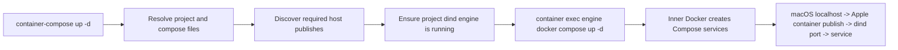

# Architecture

## Overview

Provide a Docker Compose-compatible command path for Apple `container` by
running Docker Engine and Docker Compose inside a Linux container managed by
Apple `container`.

The intended user-facing model is:

```bash
container-compose up -d
container-compose ps
container-compose down
```

Internally, this is proxied to:

```bash
container run ... docker:28-dind
container exec <engine> docker compose ...
```

## Architecture

### Components

1. CLI parser
   - Accepts Docker Compose-like arguments.
   - Consumes proxy-specific options such as `--engine-name`, `--engine-image`,
     `--memory`, `--cpus`, `--publish`, and `--no-auto-publish`.
   - Passes remaining arguments through to `docker compose`.
   - Dispatches `engine <action>` lifecycle commands without invoking Compose.

2. Project resolver
   - Resolves `--project-directory` and `-f/--file`.
   - Defaults to the current directory and common Compose filenames.
   - Mounts the project directory into the dind engine at `/workspace`.

3. Engine manager
   - Uses a deterministic project-scoped engine name based on the project
     directory name, such as `cc-my-project`.
   - Long project names are truncated with a short path hash suffix.
   - Starts `docker:28-dind` with:
     - `/run` tmpfs
     - `/var/run` tmpfs
     - `--cap-add ALL`
     - project bind mount at `/workspace`
     - precomputed Apple `container -p` publishes
   - Waits until `docker version` succeeds inside the engine.
   - Supports lifecycle actions:
     - `engine start`
     - `engine status`
     - `engine stop`
     - `engine rm`
     - `engine recreate`
     - `engine logs`
     - `engine storage`
     - `engine prune-storage`

4. Port mapper
   - Scans Compose `ports:` short syntax and common long syntax fields.
   - Maps `8080:80` to Apple `container -p 127.0.0.1:8080:8080`.
   - Maps `127.0.0.1:15432:5432` to
     `container -p 127.0.0.1:15432:15432`.
   - Maps long syntax `published: "8080"` to
     `container -p 127.0.0.1:8080:8080`.

5. Compose runner
   - Executes:
     `container exec --workdir /workspace <engine> docker compose ...`
   - Rewrites Compose file paths to `/workspace/...`.
   - Passes the host project directory name as `--project-name` unless the user
     explicitly provides `--project-name`.

### Request Flow



## Constraints

### Apple `container` 1.0+ Capability Requirement

Apple `container` 1.0+ is the target baseline. On 1.0.0, `docker:28-dind`
exits with `mount: permission denied` unless the outer engine container is
started with `--cap-add ALL`.

The wrapper therefore enables `--cap-add ALL` by default. `--no-cap-add` exists
only for debugging constrained environments.

### Port Publishing

Compose publishes ports inside the dind VM. macOS cannot see those ports unless
the outer Apple `container` engine was started with corresponding `-p` mappings.

Implication:

- Port mappings must be known before engine creation.
- Changing Compose ports requires engine recreation.
- Auto-detection handles short syntax and common long syntax fields.
- Inner Compose services should publish on `0.0.0.0` or omit `host_ip`.
  `host_ip: 127.0.0.1` can work inside dind but fail through Apple `container`
  host forwarding.

### Storage Persistence

The current implementation mounts an Apple `container` volume at
`/var/lib/docker` by default. The default name is derived from the generated
engine name:

```text
cc-<project-name>-docker
```

This keeps inner Docker images and volumes across dind engine recreation.
`--storage none` disables this for disposable engines, and `--docker-volume`
selects an explicit volume.

`engine storage` displays the resolved volume and whether it exists.
`engine prune-storage` removes the engine first and then deletes the Docker data
volume, intentionally discarding inner Docker images and volumes.

### Compose File Volumes

Volume entries in `docker-compose.yml` are handled by the inner Docker Compose
process without proxy-side model conversion.

Implication:

- `services.*.volumes` named volume entries create Docker volumes inside the
  dind Docker Engine.
- In `app_data:/var/lib/app/data`, `app_data` is a named volume source
  and `/var/lib/app/data` is the service-container target path. The target
  path does not need to exist on the dind host.
- top-level `volumes:` definitions are interpreted by Docker Compose normally,
  including project-name prefixing and driver options supported by the inner
  Docker Engine.
- The proxy passes the host project directory name as the Compose project name,
  so a project directory named `example-service` creates
  `example-service_app_data` for a named volume `app_data`.
- Those Compose-created Docker volumes are persisted because `/var/lib/docker`
  is backed by the project-scoped Apple `container` volume.
- Relative bind mounts work when they resolve under the configured project
  directory mounted at `/workspace`.
- In `./app_data:/var/lib/app/data`, `./app_data` is a host-side bind
  source. The proxy preflights that source before `up`, `run`, and `create`.
- Absolute bind mounts or relative paths outside the project directory are not
  available unless the proxy gains additional host mount support.
- `external: true` volumes are not auto-created, matching Docker Compose
  behavior. They must exist inside dind first.

### Platform And Rosetta

The dind engine runs as `linux/arm64` by default. For inner Compose services
that require `platform: linux/amd64`, the outer Apple `container` dind engine
must be created with `--rosetta`.

The wrapper exposes `--rosetta` and passes it to `container run`. It also rejects
reuse of a running engine when Rosetta is requested but the existing engine was
created without it, because Apple `container` runtime options are fixed at
engine creation time.

### Compose Feature Coverage

Verified:

- image pull
- service start/stop
- bind mount from project directory
- Compose file named volumes
- simple port publish
- long syntax port publish
- build contexts
- BuildKit build through dind
- named volumes
- multi-service DNS
- custom networks
- healthchecks
- secrets/configs
- profiles
- environment file path rewriting
- `platform: linux/amd64` services through Rosetta
- persistent Docker image cache through Apple `container volume`
- persistent Compose-created Docker volumes through the dind `/var/lib/docker`
  Apple `container volume`
- `ps`

Not yet verified:

- non-`linux/amd64` foreign architectures

## Verified Coverage

The test suite covers:

- Project-scoped engine naming.
- Apple `container` 1.0+ dind launch with `--cap-add ALL`.
- Compose command proxying through `container exec`.
- Short-syntax and common long-syntax port detection plus manual `--publish`
  support.
- Project-scoped Apple `container` volume mounted at `/var/lib/docker`.
- Engine lifecycle commands: `start`, `status`, `stop`, `rm`, `recreate`,
  `logs`, `storage`, `prune-storage`.
- Unit tests for config resolution, port mapping, engine command generation,
  and `inspect` state parsing.
- Pytest integration test for `up`, localhost curl, `down`, engine recreation,
  Docker image cache persistence, and cleanup.
- Pytest integration test for `build`, named volumes, custom networks, and
  service DNS.
- Complex feature checks for healthchecks, profiles, `env_file`, secrets, and
  configs.
- Rosetta-backed integration check for `platform: linux/amd64` services.
- Direct `container-compose up` entry point coverage from a fixture project
  directory and explicit `-f` Compose file selection.
